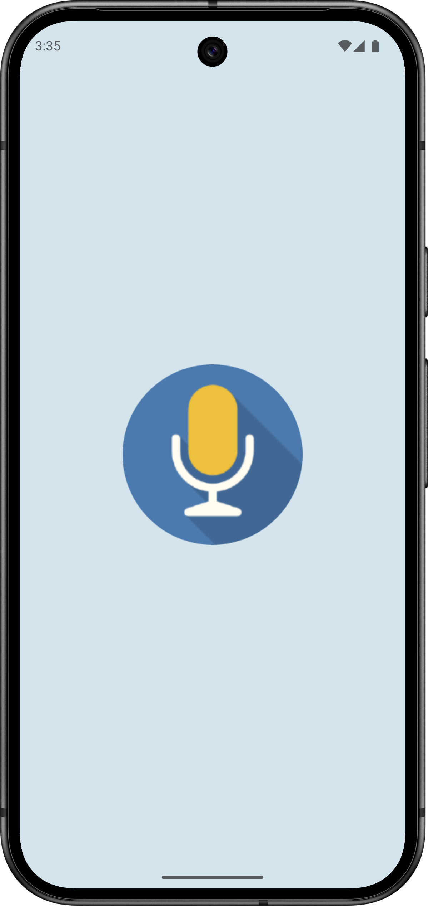
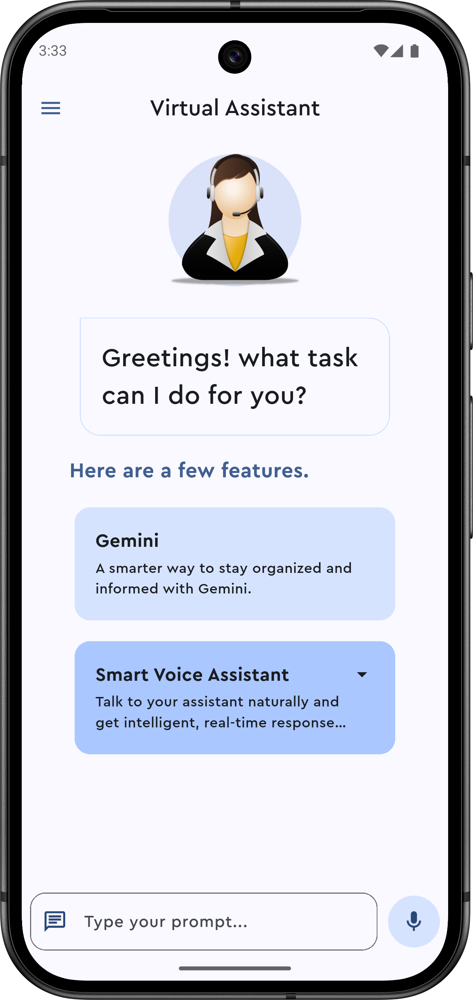
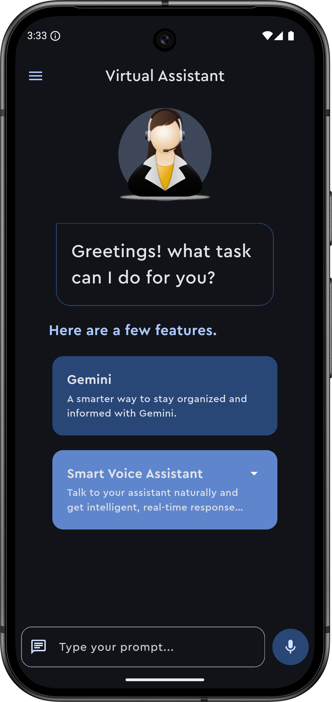
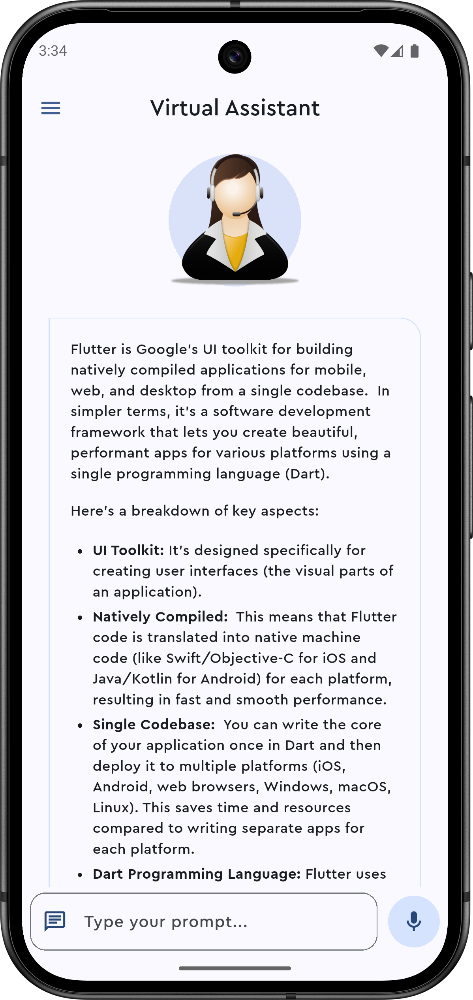
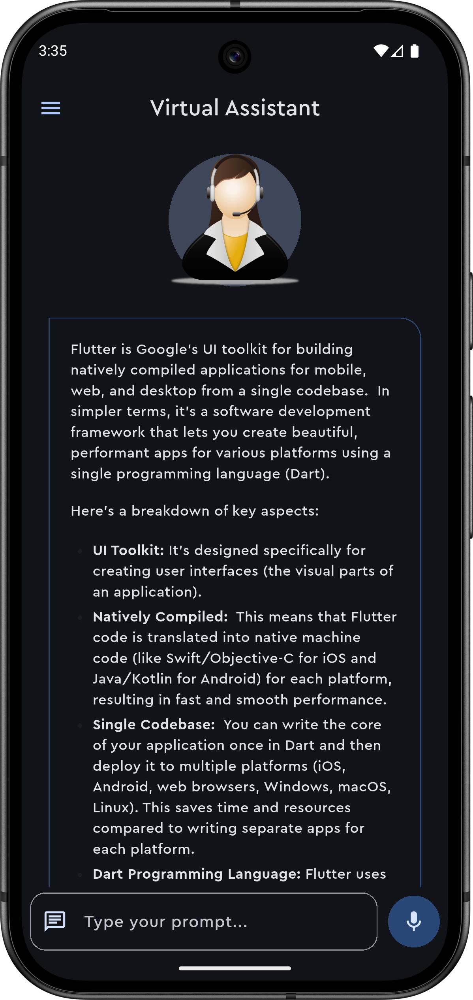
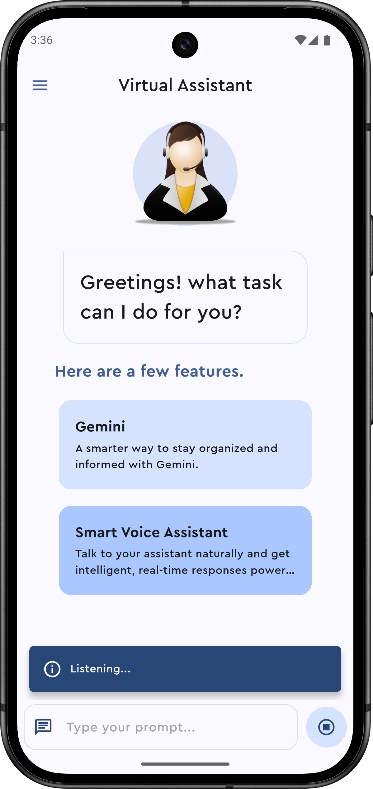

# 🎙️ Virtual Assistant

## 📝 Overview

The **Virtual Assistant** App leverages the power of Gemini’s AI API to assist users in real-time through text and voice interactions. Designed to enhance daily productivity, the assistant supports a conversational interface with support for multiple languages, voice input, and both light and dark themes. The app is structured using the BLoC pattern for optimal state management and scalability.

## 🎯 Objectives

The primary goal of this project is to create a user-centric mobile solution that:

- Create an intelligent assistant that provides accurate and relevant responses using Gemini AI.
- Enhance user accessibility through multilingual voice recognition.
- Offer a clean, user-friendly interface with customizable themes.
- Ensure maintainability and scalability through proper state management using the BLoC architecture.

## 💻 Technologies

- **Flutter** – Cross-platform UI toolkit for building natively compiled mobile applications.
- **Dart** – Primary programming language for Flutter development.
- **Bloc (Flutter)** – State management solution ensuring a reactive and maintainable codebase.
- **Gemini RESTful API** – Gemini RESTful API.
- **Speech Recognition** – For converting speech to text in multiple languages (English, Urdu, Hindi).
- **Shared Preferences** – To persist theme settings and preferences.
- **Material Design** – For consistent UI/UX across platforms.

## 🚀 Key Features

- ✅ AI-Powered Responses: Real-time intelligent responses using Gemini API.
- 🎤 Voice Recognition: Supports input in English, Urdu, and Hindi.
- 🌗 Dark & Light Themes: Switch between themes for better readability and user preference.
- 🔄 Robust State Management: Maintains consistent behavior using the BLoC architecture.
- 🌍 Multilingual Input: Handles voice inputs in multiple languages effectively.
- 📱 Responsive UI: Works seamlessly across different screen sizes and platforms.

## 🖼️ Screenshots

- ### Splash Screen

<picture>
    <source srcset="screenshots/splash_screen.png" media="(max-width: 400px)">
    
  </picture>

- ### Main Screen (Light & Dark Theme)

  <picture>
    <source srcset="screenshots/main_screen_light.png" media="(max-width: 400px)">
    
  </picture>
  &nbsp;&nbsp;&nbsp;
  <picture>
    <source srcset="screenshots/main_screen_dark.png" media="(max-width: 400px)">
    
  </picture>

- ### Response (Light & Dark Theme)

  <picture>
    <source srcset="screenshots/response_light.png" media="(max-width: 400px)">
    
  </picture>
  &nbsp;&nbsp;&nbsp;
  <picture>
    <source srcset="screenshots/response_dark.png" media="(max-width: 400px)">
    
  </picture>

- ### App Listening State

  <picture>
    <source srcset="screenshots/app_listening_state.png" media="(max-width: 400px)">
    
  </picture>

## 🙏 Credits
- 🖼️ App Icon from [Stockio](https://www.stockio.com/free-icon/microphone-filo-icon).
